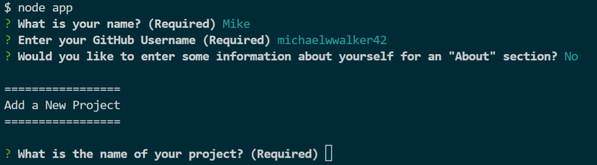

# Portfolio Generator

## Description
A node.js app to create a portfolio from user prompts in the command line.

## Installation
 Clone the repo to your local computer.   
 At the command line, type the following commands:   
   npm init  
   npm install  
   npm install inquirer 
## Usage
Type node app (or node app.js) in the command line, then answer the prompts to create your portfolio page

[Link to Github repo](https://github.com/michaelwwalker42/portfolio-generator)

